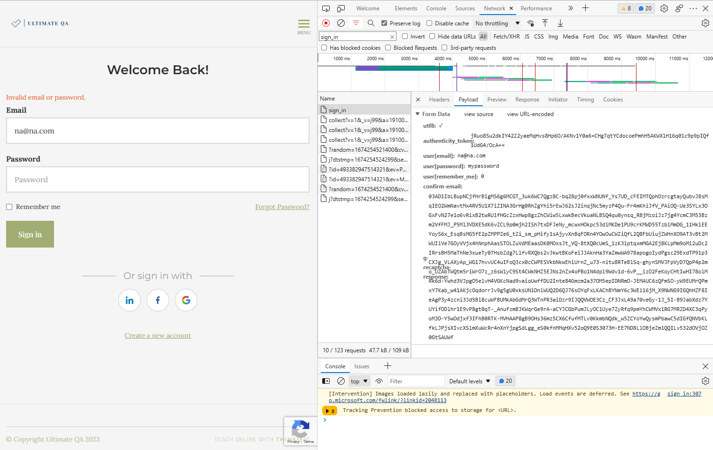
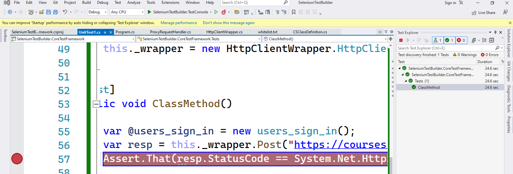

# SeleniumTestBuilder

Build codeless automation tests using Selenium + Code Generation.

LET'S STOP WRITING MANUAL TESTS!!

## Overview

This project removes the hassle of writing and maintaining automation tests which utilizes C# + Selenium.
The server within this application records user actions, and convert them to C# code which can be imported into existing test frameworks. The ultimate goal is to allow the creation of complex Selenium tests without having to write any code, but still allowing for 100% customization should there be a need.

## Features

- Capture API requests
- Generate NUnit C# Test

## What's supported 

APIs - Fully supported [GET, POST, PATCH, DELETE]

### API Unit Test Generation
This library captures XHR / API requests within chrome, and generates a C# Unit Test representation of that request including body payload construction and query parameter model construction. (ie: The body is automatically parsed and classes are created to represent the JSON object.) 

> **Important!**:
>
> Only endpoints whitelisted will be captured.
>
> Line delimeted endpoints can be specified in "whitelist.txt" within the [SeleniumTestBuilder folder](SeleniumTestBuilder/whitelist.txt).

Front End - Not yet supported.

---

### Example
Capture [/sign_in](https://courses.ultimateqa.com/users/sign_in) endpoint from ultimateqa.com

1. Visit [Ultimate QA](https://courses.ultimateqa.com/users/sign_in) (in launched chrome window).
1. Sign In
1. View "export" folder in debug.
1. Import CS file into existing project. (Please be sure to add reference to SeleniumTestBuilder.HttpClientWrapper project)




Generates the following code:

```
using Newtonsoft.Json;

namespace SeleniumTestBuilder.CoreTestFramework
{
    public class Tests
    {
        public class users_sign_in
        {
            [JsonProperty("utf8")]
            public string utf8 { get; set; }
            [JsonProperty("authenticity_token")]
            public string authenticity_token { get; set; }
            [JsonProperty("user[email]")]
            public string user_email_ { get; set; }
            [JsonProperty("user[password]")]
            public string user_password_ { get; set; }
            [JsonProperty("user[remember_me]")]
            public string user_remember_me_ { get; set; }
            [JsonProperty("confirm-email")]
            public string confirm_email { get; set; }
            [JsonProperty("g-recaptcha-response")]
            public string g_recaptcha_response { get; set; }

            public users_sign_in()
            {

                this.utf8 = "%E2%9C%93";

                this.authenticity_token = "272jSx%2BTalrPY2cfs05QqWVsOHCg%2BaVbfKIuSFTm8RJiirSn8FZLRxHDxcBGh%2Big6r2%2BjT5Rrm%2F8qKKrghcPVA%3D%3D";

                this.user_email_ = "na%40na.com";

                this.user_password_ = "password";

                this.user_remember_me_ = "0";

                this.confirm_email = "";

                this.g_recaptcha_response = "03AD1IbLBkP7rVtKZlGpmn-KyVu9z0F2Owmwj1faTqUHSbDg4rnHJiLuAbaiEvMp1OTtBWXrrzuAo_mFE-cw3o8t9UHEuFtaWB8G9Athz4SRuUFiHYHaWSEpSbzEcRyauf7NuOpWzsVgbbt9taN-gGILL1U1r7liTUzi-L0Jev3wnKBEW_gKQAuax3tJa6U6xgazWQvyh82lSQpj4uwdg8j_ZgYcp6h3nUyEGkHe2TnnLALJwLoF9p0K-sEdt9CDztp7k-o4IW0jQzId1IrzUbDMp8IY23cbl8OBKH32SD0zm2y2HxGVhxHh4ENUaz9mcyiR34Xs5aKzIUASailuY0kMho_GW9fTqJExE_xR9LMswvBAIMJoWaZBgcRhbrqWohDzT9BmvMSL7tebBoAA1VtM1IREy4r95LAy50MMYb5dVWX54uTTx-1lyp2KjpOwPrxN6zevKhcO5yBqEjPXJq6oppS1yedSnbta4kbgoIgtmcgyMxfbuqXhF4fk15Qn2PgTsckvbfHta4eHk7jzP7HJp7LZ_cDa27W2fd1BQ5VFrYd_9DLA6LGWJQrjDqifSubXUrOIpX7ki8A6rZyyuJIdAZliaAaCHuSNVQ_b4CNa4IGlmjh9pnJppRJrPde4dxiVeF2ttf5UHIO7pSpgWOsBtSwXsk_sTL12T8erSPCu1ZV9L4753iDQMQ0AdKx10ks2Jd6XZC8Bqxl1-54M7Mltw_-DLvtOFjgBROPo5cKYuup72gSC9rbmQZ7-9-tGu4f6PBIjWkuZXcYtMMr5gvLTVA2sTt221fadiFXaN-Okw2OMPnWUziAT49tYboeZ9K-Cme3vOJkq5P1DuPl1jQlhVsXKZd3CLzCfdUq1NXQSfhtoNzKMCELGcF1CAmQI0juvgsYOq8jVKKf34CwFqzJCH9-qOmeBGliaZ-ChIooiOIJo1eg516rn5C7QsnOKIgxBI9LZC9igubKiYA4sncIU3mvI1saqua6sVxniUsX-EEMV0WPQ1b69rFQFHLrm4SkVvcsCz-BV2B0pYYlNWA0DikYwQidXAzDH_n4F5plxaUiXOxWgIjUwli0vDa_sl2SyRpLeEQ0SOKoBcXo2jAm7WOrUy6foVh1P48rsovy0AbzSKojFQEMnGT2Th1QRe8sC5rD4wYz-Ub6iH35cLQVTJYyOg8GxKtIhX0-1wyaxyc_kJP9F4VnOJMK9rpgx1BetRw_N_IbtYl2RiFa584LetboPJ34dHQJL8_7lKEd1l7W8546_bNI_JhyKDMYLwy0aHeyZDxQthanUMowhV1tPaXLO-BxJCNEiSAftoBaE3S7neYlhIBJ65Lx13kvHpT8_GRtM3QtUbc6-ViRgBdkI_WYlaDOfCRmTBmVBTD0M6lyn-jNOD7OOyhdZungumq3GF_xkrgq9Yam-W3oB_wOnbxdQzreiQV07j76q2T64rxIUKdYpbgxuwmsH_hDMd_pfoZJ6xpWGpDoyqnOpp42NJ7Ko4Gi1opbpJUz6w58gZwqP8qPVLIGdgod9vDM-7Ccakx9n_gdTJb5oRTL4b2MTPA8n2WuyWBkWC5Yxg82erXE-id5UCn5mKdMMkapZu7xCgGzCvtMLy6";
            }
        }


        private HttpClientWrapper.HttpClientWrapper _wrapper;

        [SetUp]
        public void Setup()
        {
            this._wrapper = new HttpClientWrapper.HttpClientWrapper();
        }

        [Test]
        public void ClassMethod()
        {
            var @users_sign_in = new users_sign_in();
            var resp = this._wrapper.Post("https://courses.ultimateqa.com/users/sign_in", @users_sign_in, true).GetAwaiter().GetResult();
            Assert.That(resp.StatusCode == System.Net.HttpStatusCode.OK);
        }
    }
}
```